# nix-types

__Disclaimer: While `types` are great. This doesnt introduce any types into nix.__

This project aims to induce some *convention* on the current typing system in nix.

Although nix doesn't have a type system, it has types. (See [here](https://nixos.org/manual/nix/stable/language/values.html))

Because there are different ways for developers to express typings they are very inconsistent.

There are multiple ways to document a type:

- With `Type:` comments.
  - unchecked
  - parsed by custom tooling to generate documentation.

- With `mkOption`.
  - checked
  - only works for nixOS-Modules.

:construction: :construction: Any help welcome! :construction: :construction: 

Scope:

- Clarify and unify typing annotations.
- provide the same for nixos modules
- compatibility and extensability by e.g. 'nil' for linting /  or documentation generators.

__Not__ in scope:

- real types 
- type inference

## Abstract



Type systems are good:

- A good type-system can proof correctness of code at compile time.
- Additional benefits through linting, self-documenting, etc.

__`doc-strings` are the last possible solution in my opinion. Because they dont alter the nix language itself, but allow for static type checking from external tools. (like `nil`)__

Typing in docstrings has been done in `javascript` and is currently under construction in the newest version, to be fully compatible with typescript.
Also Python has made the same approach, with type annotations, but they are one, or more steps further than the current nix ecosystem is.
No nix developer want to compare himself with javascript, but the truth is, that the typing system in untyped javascript is nowadays way better than in nix.

Thats why I decided to give it a try. At least to clearify the conventions of the current type system.
And introduce a really consistent and reliable `intermediate representation`  of types in nix
In [nipkgs/lib/*](https://github.com/NixOS/nixpkgs/tree/master/lib) there are some files that contain descriptive type comments.

e.g.

`assertMsg :: Bool -> String -> Bool`

This is a very good, abstract, haskell inspired `type annotation`.

However with `mkOption` there is `nixosOptionsDoc`. Which can be used to generate self describing types from `mkOption` generated `options`

In that world

```listOf str```

evaluates to

``` "list of string" ```

Which is inconsistent with the abstract type annotations, that i like more.

Consistent format would be:

``` [ String ] ```

So I'd like to enhance the `mkOption` (more explizitly the underlying `types` and `mkOptionType`).

Also writing type comments is very tideous and those comments can drift over time, and at one point they might describe not exctly what is going on.
So enhancing nixos modules and improving documentation system on that `self-documenting` system seems really beneficial to me. 

I'd like to have the same comfort beeing used in nixos modules, as automatic documentation. Plus the convention of abstract types, that can acutally be used in a lot of enhancing tools.

- (Statically) Checking correctness of code
- Linting
- Documentation
- Indexing
- Safe usage of APIs
- etc.

## Convention

The goals:

- __Make all typings (doc-strings) consistent__.
- all docstrings can be parsed and add value to developers day to day experience.
- nixos modules follow the convention and can be used within that system.
- some first tools adopt and use the convention. (nixpkgs, nil, statix, documentation, etc.)

## What needs to change

Until there are real types in nix. Some things need to change.

### There are different names / aliases describing the same type in those two worlds. 

- `Package` vs. `StorePath` vs `Derivation` ?
- `Path` vs `String` (representing a Path)

> Clearify how those types work together and if they are the same, or subsets of each another.

### Replace duplicate types

__I would favor the existing mkOption types and create consistent outputs of them. Following the here proposed `convention`__

- `types.str` vs `String`
- `types.unspecified` vs `Any`
- `a`,`b`,`c` vs `Any` ?
- `List` vs `[]`
- `AttrSet` vs `{}`

### Add `lint doc-types` to gh-actions. 

Requires some sort of parser, where everything it doesnt accept is an invalid doc-string

> The Parser could then implement and proof the ruleset and vice versa.

### Add missing types

Maybe we need to compose or create new types

- tbd. ?

## Conventions from the `Type:` doc-strings

1. All notations are `PascalCase`, starting with capital letters.
2. Types MUST be choosen from the existing list. (see [below](#List-of-Types) )
3. Operators MUST be choosen from the existing list. (see [below](#List-of-Operators) )
4. `AttrSet` is curently an alias for `{ Any }`, same for `List` -> `[ Any ]`, -> Deprecate the Keyword and force users to explicitly type what goes inside.
5. Single letters `a`, `b`, `c` are an alias for `Any`, while they carry more informations. `# type: foo :: [a] -> (a -> b) -> [b]` (should we deprectate the `Any` keyword) and use those letters instead.
6. AttrSets definitions should include their keys if they dont accept arbitrary values. (optional) ` { foo = bar; } # type: { foo :: Any }`
7. Spaces between Operators (optional) 

## List of Types

> Types from lib/types.nix:

- Any - anything
- Raw - raw
- Unspecified - Unspecified
- Bool - boolean
- Number - A number (alias int | float)

    Subtypes:

        between
        nonnegative
        positive

        Float - floating point number

        Int - signed integer
            Subtypes:

                u8
                u16
                u32
                s8
                s16
                s32
                between
                ign
                unsign
                sign
                port - u16 for a port number

- String - string
  
    Subtypes:
  
        NonEmptyStr - non-empty string
        SingleLineStr - single-line string
        StrMatching - string matching a pattern

        SeparatedString - strings concatenated with a seperator
            Subtypes:
                lines - string seperated by `\n`
                commas - string seperated by `,`
                envVar - string seperated by `:` 
        PasswdEntry - subclass of `String` not containing newlines or colons.

- AttrSet - attribute set
  
    Subtypes:

        AttrsOf - attribute set of elements
        lazyAttrsOf - lazy attribute set of elements

- Package - derivations or attribute sets with an `outPath` or `__toString` or StorePath

    Subtypes:

        shellPackage - a package with `shellPath` attribute

- Path - path to location (relative or absolute)
- ListOf - list of elements

    Subtypes:

        NonEmptyListOf - list containing at least one element

- Null - null
- Function - function that evaluates to a specific result
- Submodule - A nixos submodule

    Subtypes:

        DeferredModule - A module to be imported in some other part of the configuration
        DeferredModuleWith - A module to be imported in some other part of the configuration
        SubmoduleWith -  A module with specific attributes

- Enum - A value from a set of allowed ones
- OneOf - Any of the types in the given list
- Either - Either value of type `t1` or `t2`
- OptionType - Type of an option type
- CoercedTo - Either value of type `coercedType` or `finalType`
- Unique - Value of given type but with no merging  (i.e. `uniq list`s are not concatenated)

## List of Operators

__All Operators SHOULD be used with surrounding whitespaces.__

__Existing ones.__

- `::`  type-name seperator.

e.g. `name :: Any`

- `->` Function

e.g. `function :: Any -> Any`

- `()` Parenthesis (not a type itself, only for syntatic grouping)

e.g. `( a -> b ) -> c`

- `,` Seperator for subseqeuent entries (like in AttrSet)

e.g. `{ a :: Any, b :: Any }`

- `[]` List

e.g. `[ Any ]`

- `{}` AttrSet

e.g. `{ key :: Any }`

__Missing / Introduced with this Idea.__

### `?` optional arguments in an AttrSet.

e.g.  `{ opt :: ? Int }`

Note: The `type` side contains the `?` operator.

### `|` syntactic `Or` can be used for: `Enum`, `OneOf`, `Either`

e.g.  

`{ opt :: Int | String | Path }`

or more advanced:

```
/*
  Type: foo :: { pname :: String, version :: String} | { name :: String } -> Derivation
*/
foo = inp:
#...
```

### `${}` Usage of variables on lhs of expressions

As in AttrSets the lhs is always a `String`

the user can omit the `String` Keyword completely, and instead give context on the meaning.

sometimes we dont know the exact entries of an AttrSet, but we can give some context what the `names` represent.

e.g.

```
{ 
  ${name} :: {
    ${version} :: Derivation
  }
}
```

which is very close to plain nix

### `{}` is an empty AttrSet explizitly

e.g. `{ empty :: {} }`

passing so is needed sometimes.

### `Self` new type that allows recursion in types

e.g. `{ name :: String, children :: Self | {} }`

which will allow to specify recursive types.

### Type bindings:

Convention: As types always start with Capital letters; Type bindings also start with capital letters.

e.g. 

```nix

/*
 Type: 
   foo :: { car :: Car } -> Any
   Car :: { wheels :: Number, color: String }
*/
foo = {car}: 
# ...

```

Those bindings should be scoped with an usefull mechanism, which could be:

- File wide
- Project wide
- Declaration block
- Same scope as refenced function binding has

### `...` - arbitrary input values

> What typings do we need `for {...}@inp:` ?

Proposal 1:

add `...` to the __Operators__
e.g. 

```
/*
  Type: foo :: { bar:: Any, ...} -> Any
*/
foo = {bar, ...}@inp:
#...
```

Proposal 2:

use existing techniques

```
/*
  Type: foo :: { bar:: Any, ${rest} :: Any } -> Any
*/
foo = {bar, ...}@inp:
#...
```

Proposal 3:

like proposal 2, but with a type alias for `${rest} :: Any`

with 

```
  Rest :: ${rest} :: Any 
```

becomes 

```
/*
  Type: foo :: { bar:: Any, Rest } -> Any
*/
foo = {bar, ...}@inp:
#...
```

### `<>` Parametrized 

simple:

```
/*
  Type: foo :: <T> -> <T>
*/
foo = inp: inp
```

Type generic to indicate that the return type depends on the input type.

advanced:

```
/*
  Type: foo :: [ { bar :: <T>, baz :: String} ] -> { ${name} :: <T> }
*/
foo = inp:
#...
```

> I am not sure yet if this addition of complexity is a good idea


