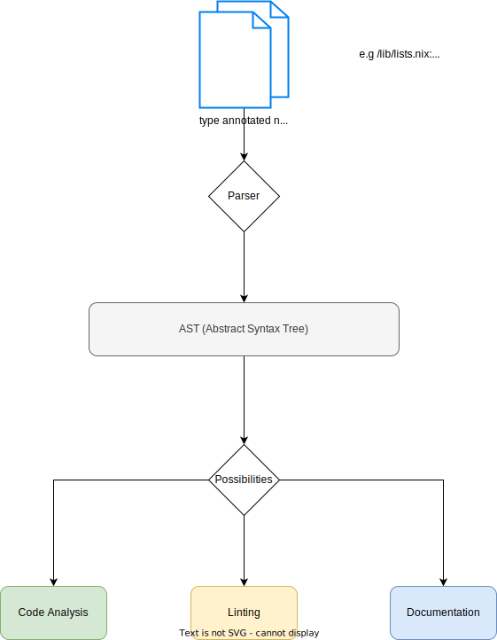

#️⃣ discuss with us on matrix: https://matrix.to/#/#nix-types:matrix.org #️⃣

# nix-types RFC (draft)

This Draft of an RFC could be the first step to improve how nix is used as a language.

## :construction: :construction: Any help welcome! :construction: :construction: 

__Disclaimer: While `types` are great. This doesnt introduce any types into nix.__

This project aims to induce some *convention* on the current typing system in nix.

## Scope

Introduce a convention on how to write doc-strings that have type information in them.
Currently there is the `type:` pattern which can be parsed from nixdoc. Which is a good start but not enough.
The goal is to build more accurate type comments and have a consistent convention on what is actually allowed and what is not.  

Although nix doesn't have a type system, it has types. (See [here](https://nixos.org/manual/nix/stable/language/values.html))

Because there are different ways for developers to express typings they are very inconsistent.

Generally there are two type systems:

- __Static__
  checked during 'compile' time or development time. 
  So errors can be caught while writing code.
  
- __Dynamic__
  checked at runtime. 
  While the programm runs and fails, errors will abort execution, until handled specifically.
  In other words: The code is already wrong and will be detected, by the user who runs the programm.

The nixos modules system has option types which are dynamic types. In fact nix doesnt have a static type system.
The scope of this project is to build a static type system, that allows writing doc-strings, that can __1. produce good documentation__ and __2. Parseable type strings__ and later we might refine the type system so it can be used as __3. source for static code analysis__, which could allow for linting, and autocompletion through a language server like `nil`.

Currently there are multiple ways to document a type:

- With `Type:` comments.
  - unchecked ❎
  - could be source for __static__ analysis, but LANGUAGE RULES are missing
  - parsed by custom tooling to generate documentation.

- With `nixos modules`. (`mkOption`)
  - checked ✔️
  - dynamic type checking. (another world, leave it for now please ;) )
  - __has no outputs for static analysis at all.__
  - automatic documentation (possible, could be better)
  - only works for nixOS-Modules.

So the necessary steps:
- Clarify and unify typing annotations. 
- provide a mapping of nixos modules option types to the static types.
- compatibility and extendability by e.g. 'nil' for linting /  or documentation generators. (via AST)

__Not__ in scope:

- real types 
- type inference
- backwards compatibility 
  - There is no existing system on static typings, so we can and should break toolchains that rely on the current system.
  - We should provide alternatives and arguments for a change.
  - Better system, less errors
- dynamic types (e.g failures in mkOptions, like `types.package` )

## Static types

I propose to build a set of simple yet effective `static types` instead of following the dynamic types from the `option types`.
As i am not a type theorist but from my perspective few static types can represent a lot of dynamic ones. 

e.g

| static  	|  option types 	|   	
|---	|---	|	
| String  	|  String 	|
| String  	|  CommaSeperatedString 	|
| String  	|  EmptyString 	|
| String  	|  NonEmptyString 	|

Mainly those are the same `types` from a static perspective because it makes no difference if you have an empty string, or a comma seperated one, you can always perform the same operations on them. like `split` `indexOf` `optionalString` `etc` it doesnt matter. Those are only dynamic checks and not real types.

## Abstract



Type systems are good:

- A good type-system can proof correctness of code at compile time.
- Additional benefits through linting, self-documenting, etc.

__`doc-strings` are the last possible solution in my opinion. Because they dont alter the nix language itself, but allow for static type checking from external tools. (like `nil`)__

Typing in docstrings has been done in `javascript` and is currently under construction in the newest version, to be fully compatible with typescript.
Also Python has made the same approach, with type annotations, but they are one, or more steps further than the current nix ecosystem is.
No nix developer want to compare himself with javascript, but the truth is, that the typing system in untyped javascript is nowadays way better than in nix.

Thats why I decided to give it a try. At least to clearify the conventions of the current type system.
And introduce a really consistent and reliable `intermediate representation`  of types in nix
In [nipkgs/lib/*](https://github.com/NixOS/nixpkgs/tree/master/lib) there are some files that contain descriptive type comments.

## Convention

The goals:

- __Make all typings (doc-strings) consistent__.
- all docstrings can be parsed and add value to developers day to day experience.
- nixos modules follow the convention and can be used within that system.
- some first tools adopt and use the convention. (nixpkgs, nil, statix, documentation, etc.)

## What needs to change

Until there are real types in nix. Some things need to change.

### There are different names / aliases describing the same type in those two worlds. 

- `Package` vs. `StorePath` vs `Derivation` ?
- `Path` vs `String` (representing a Path)

> Clearify how those types work together and if they are the same, or subsets of each another.

### Add `lint doc-types` to gh-actions. 

Requires some sort of parser, where everything it doesnt accept is an invalid doc-string

> The Parser could then implement and proof the ruleset and vice versa.
> outputs an AST, also described within this Project

### Add missing types

Maybe we need to compose or create new types

- tbd. ?

## basic rules for writing `type:` comments

1. `type:` starts the type block. Followed by at least one line-break

The type block is never terminated and expands till to the bottom of the `/* multiline comment */`

This is actually how comments are parsed today.

2. Within one block multiple declarations are allowed.
3. All declarations are `PascalCase`, starting with capital letters.
4. Types MUST be choosen from the existing list. (see [below](#List-of-static-Types) )
5. Operators MUST be choosen from the existing list. (see [below](#List-of-Operators) )
6. `AttrSet` and `List` keywords are PROHIBITED. Writers must express explizitly if they want to allow arbitrary values. e.g. `AttrSet` is an alias for `{ ... }` (explained below), same for `List` -> `[ Any ]`
7. AttrSets definitions should include their keys if they dont accept arbitrary values. `{ foo = bar; } # type: { foo :: Any }`
8. Spaces between Operators (optional) 

## List of static Types

### Basic

- Bool
- Int
- Float
- String
- Path
- Null

### Nested

Nested types MUST always specify their content type.

- AttrSet represented as `{}`
- List represented as `[]`
- Lambda represented as `->`

### Usage of nested types

#### List

The superset of all possible Lists with all possible elements is the following: 

`[ Any ]`

A List of a specific Type `T` is that sub-set of the `[ Any ]`-set that contains only elements of the exact type `T`.

A list can contain no, one or multiple elements of that given type `T`.

e.g.

`[ String ]`

`[ Number | Bool ]`

#### AttrSet

declaration of an AttrSet

1. ${ name :: String } `= [ String ]`

or in short form `${name} = [ String ]`
where `name` is a freely chosable variable to represent the context that the `String` type represents.

2. `::`-operator within `AttrSet` 

The `::`-operator maps every Type of its `left-hand-side` `Iterable` to the `Type` on its `right-hand-side`.
By doing so it is always assured that an AttrSet has the same amount of `name types` as `value types`.

an Attrset can also be represented as

```nix
  { [ String ] :: Any } 
```

__`{}` represents an empty AttrSet explizitly__ 

`{} = { [ String ] :: Any }` where the `[String]` is an empty list

passing empty `AttrSets` is needed sometimes.

__`{ foo :: String }` maps the name of `foo` to value of type `String`

{ [String Number] } `= [Tuple(String, String) Tuple(String, Number)]`

__`${}` Usage of variables on lhs of expressions__

As in AttrSets the lhs is always a `String`

the user can omit the `String` Keyword completely, and instead give context on the meaning.

`${context} = [ String ]`

sometimes we dont know the exact entries of an AttrSet, but we can give some context what the `names` in that `context` represents.

e.g.

```nix
/*
type:
  packageMap :: { 
    ${name} :: {
      ${version} :: Derivation
    }
  }
*/
packageMap = {
  "gcc-utils" = {
    "1.2.3" = builtins.Derivation {...};
    };
  # ...
  };
```

#### Lambda

let Lambda `= Any -> Any` the set of all possible lambdas.
Let the `LHS` of `->` be the `Argument type` of that `lambda` and the `RHS` the return value type.

Then a lambda that takes type `T` and returns type `U` can be declared as the subset of all possible lambdas with both `T` on the `LHS` and type `U` on the RHS.

Let `()` be a semantic group to encapsulate either the LHS or the RHS of a lambda.

then the following lambda notations are possible.

```
Number -> Number

[ String ] -> ( String -> Number ) -> [ Number ]

(Path -> String) -> { ${name} :: Path } -> { ${name} :: String }
```

### `|` syntactic `Or` can be used for composition or enums

Let `T` and `U` be different Types.
Then the `|` operator evaluates to either `T` or `U`.

e.g.  

`{ opt :: Int | String }`

> The evaluation of the `|` operator would happen at compile time in a static type system, but this is not a real static type system therefore the evaluator never actually picks one type.

### Composed Types`

Now with the base defined we can define composed types.

- Number `= Int | Float`

A `Number` can be either an `Int` or a `Float` type.

- Any `= [ Any ] | { ... } | (Any -> Any) | Bool | Int | Float | String | Path | Null` 

An `Any` can be either a basic type or a nested type of `Any`

### more Global Types

Some Types are commonly used within nix and nixpkgs therefore it makes sense to have some more Global Types.
Those are types defined globally within nix as they are almost always needed.

StorePath `::= Path`
Derivation `::= { # TODO... }`
Package `::= # TODO..`


Basically thats all static types that i could find in all `nixpkgs/lib/*` files and i read through all the `type:` annotations.
Where i spoted many weird nonsense-types and inconsistencies.

Also the naming of `lib/types.nix` is confusing as that file doesnt contain any usefull types.

## List of Operators

__All Operators SHOULD be used with surrounding whitespaces.__

### `::`  declares the type.

The variable name on the LHS is declared to have the `type` on the RHS

e.g. `name :: Any`

Those declarations can appear only once AND only at the root level of a type block.

### `()` Parenthesis (not a type itself, only for syntatic grouping)

e.g. `( a -> b ) | Bool`

### `,` Seperator for subseqeuent entries (like in AttrSet)

e.g. `{ foo :: Any, bar :: Any }`

### `//` operator to syntactically `merge` Types of AttrSets

e.g. `{ foo :: String } // { bar :: Any }` => `{ foo :: String, bar :: Any }`

### `=` equality operator. Allows for __type bindings__

Convention: As types always start with Capital letters; Type bindings also start with capital letters.

Binding types to names will allow to specify recursive types, which is required for many structures in nix.

Binding types to intermediate variables makes it harder to see which declaration is related to the actual code.

e.g. 

```nix

/*
 Type: 
   DerivationAttrs = { buildInputs :: [ Derivation ], ... }
   MkDerivationAttrs = DerivationAttrs // { buildInputs :: String }
   mkDerivation :: MkDerivationAttrs -> Derivation
*/
mkDerivation = {pname, version, foo, ...}@args: let
# ...

```

Those bindings should be scoped with an usefull mechanism, which could be:

- File wide
- Project wide
- Declaration block
- Same scope as refenced function binding has


e.g. 
```
  type:
    foo = Any
```

### `?` optional arguments in an AttrSet.

e.g.  `{ opt :: ? Int }`

Note: The `type` side contains the `?` operator.

### `"` Literal type

Literals are strings, of specififc values.

e.g. `{ foo :: "bar" }` specifies the name `foo` to be only of value "bar"

```
{
  foo = "bar";
}
```

This can be usefull for constant fields, which are always the same across specififc types.

### `...` - arbitrary input values

can only be used within an AttrSet

`...` = `[ String ] :: Any` within in an AttrSet context

e.g. 

```
/*
  Type: foo :: { bar :: Any, ...} -> Any
*/
Foo = {bar, ...}@inp:
#...
```

## Some Best practices

- Use the `Type` postfix for creating typing aliases
- Start with the most abstracted declaration first. 
- Linebreaks and trailing commas in AttrSets and Lists.
- Create aliases to reduce complexity if needed.
- Use type comments wherever possible to increase maintainabilty and discoverabilty for others 

e.g.

```

/*
  Type:
    packageSetInfo = {...} -> InfoType
    InfoType = {foo :: Any, ...}
*/
packageSetInfo = attrs: getInfo { inherit attrs; };

```

## About the modules (nixos modules)

nixos modules typing system is dynamically evaluated. It misses (like everyting else) __static__ analysis possibilities.

With the power of both worlds, static & dynamic, nix developers should be able to get high quality code up and running more reliable, faster and with less brainload. So developers can focus on more important parts of their nix applications.

The module system can provide both type checking, automated documentation (via `nixosOptionsDoc`) and potentially with this project; __Static type checking__ 

### Potential Impact

Writing type comments is very tideous and those comments can drift over time, and at one point they might describe not exctly what is going on.
So enhancing nixos modules and improving documentation system on that `self-documenting` system seems really beneficial to me. 

I'd like to have the same comfort beeing used in nixos modules, as automatic documentation. Plus the convention of abstract types, that can acutally be used in a lot of enhancing tools.

Writing a nixos module, should yield the same abtract `intermediate format` described in the previous chapters.

So the same tools can process nixos modules, without great additions, or the need for a second parser.

### Connect dynamic and static typings

As the __dynamic types__ and __static types__ are very different the need to be connected somehow.

I propose the following:

#### Mapping of Dynamic types into Static types.

As the dynamic types already exist, that initial mapping should be done. In the dynamic world the same type may have a different name.

e.g. `Derivation` vs `Package` (they are not the same ?!)

#### Deal with leftovers

As both worlds are joined, there might be __leftovers__ which cannot be mapped from one world into the other.

We need a solution for them or just let them unhandled.


### Consistency

`assertMsg :: Bool -> String -> Bool`

This is a very good, abstract, haskell inspired `type annotation`.

However with `mkOption` there is `nixosOptionsDoc`. Which can be used to generate self describing types from `mkOption` generated `options`

In that world

```listOf str```

evaluates to

``` "list of string" ```

Which is inconsistent with the abstract type annotations, that i like more.

Consistent format would be:

``` [ String ] ```


