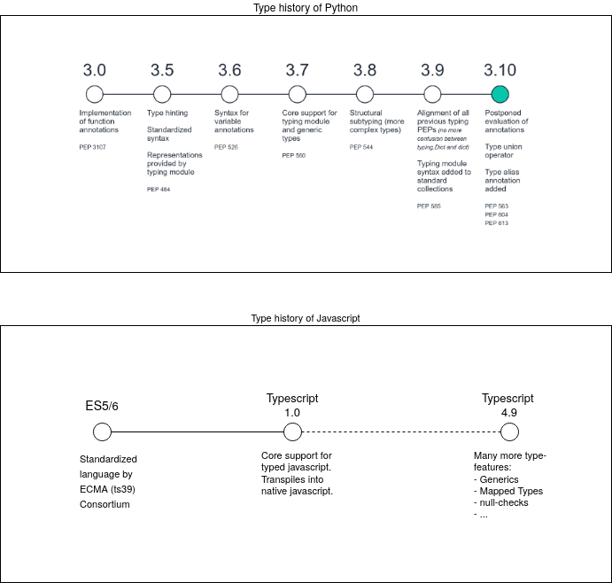

# Introduction

This RFC prioritizes in the first place how documentation of nix can consistently be improved.

By specifying the doc-string format for nix this opens a wide range of possibilities.

One of the biggest issues and working points in the nix ecosystem is __Documentation__. Although documentation is available on different platforms and also on the official pages of nix and nixpkgs.
Most beginners and advanced users still struggle and need unnecessary time to find the right starting point.

__By specifying doc-strings I hope to improve the quality of in-code-comments so we can automagically build different formats of documentation.

Specifying syntax rules for type annotations in comments is also very important as those need to be parsed consistently. To provide analysis over those types.

External tool like: [noogle.dev](https://noogle.dev) already utilize and demonstrate the enormous potential that lies in understanding `type` abstractions.

## Goal: standardize current comment syntax

Currently there is no `strict ruleset` for how to write type comments.

There is the following convention:

```nix
/*
  Type:
  foo :: AttrSet -> Any
*/
let
foo = arg: ;#....
in
{
  # ....
}
```

__However that convention is very inconsistent and not written down yet.__

> There is the opinion that it follows the haskell syntax, but nix is not haskell and has some differences that must also be reflected in the type-syntax.

## Standardizing the format of doc-comments to make them parsable

### Big vision: Feature-rich doc-strings. That allow automatic rich-documentation

Steps toward that vision:

- Type syntax; such as: `signatures`, `attrsets`, `type everything`
    - Properly render the type signature of different things
    - Default Values of optional attributes
    - Description field for attributes
- Code Examples
- General Description

### Generally there are two type systems

- __Static__
  checked during 'compile' time or development time.
  So errors can be caught while writing code.
  
  __Does not exist in nix__  
  
- __Dynamic__
    - Fails execution of code based on conditionals.
    - Used in `lib/types.nix`
    - Used in `YANTS`
    - Used in Contracts

## Proposal: Type hints

I propose to build a set of simple yet effective `type hints`, which would mimic `static types` instead of investing to much into the dynamic types approach,
or trying to bring static types into the dynamic nix language.

By using `type hints` many additional possibilities even for dynamically typed languages arise.

- determine whether a program would actually work or not, just by looking at the types.
- provide autocompletion on typed variable- and function-bindings.
- automatically generate good documentation directly from code.
- ...

## Dynamic type validations are still needed

As type hints cannot provide any runtime assurances it is still needed to place guards in critical places.
But instead of trying to represent a non-existent static type system;
The dynamic approach should transparently communicate what it really does: "Runtime validation".

## Analogy to other dynamic languages



## Vision

This project can be seen as a first step of possibly many.

There are many opinions about whether static types make sense at all in nix.

But this project does not discuss those. Instead i propose that "types" in whatever form do make total sense. And will give much value to dynamic languages.
Which can undoubtedly be seen on the above examples (Python, Javascript).

__Discussion about__
```Does typing make sense in a dynamic Language```
__is open, but history has a clear answer to that.__

By specifying the comments and not directly integrating types
into the nix language this project stays downwards compatible
and allows an intermediate phase of transition and validation.

In that validation phase the system can obtain feedback and corrections.

It could then be made so good, that it really represents nix's type behavior.

> NOTE: Currently out of scope of this project.
> Change the nix language to natively support type annotations. (Even if they are not real static types)
> `Types` could then be built from the findings of this project.
